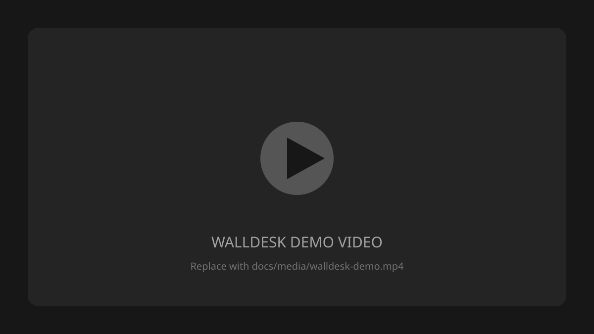
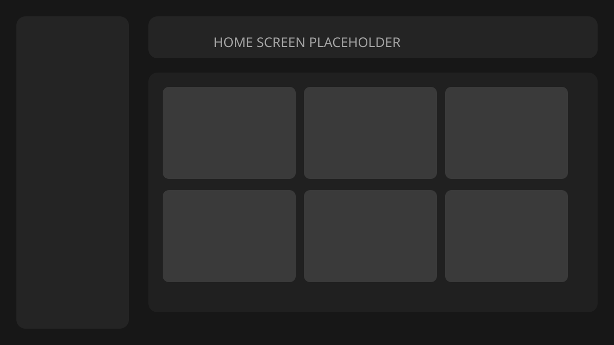
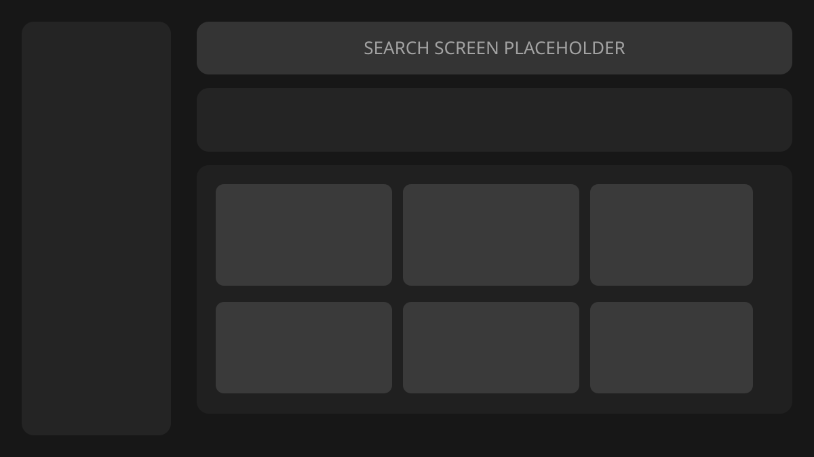
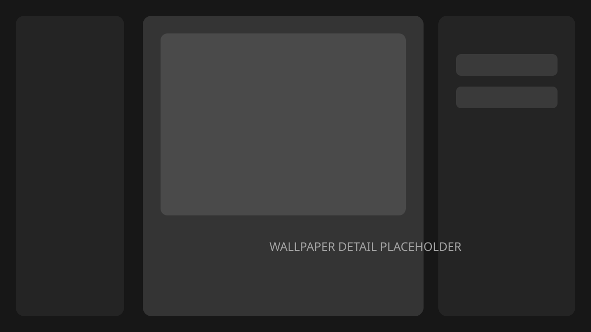
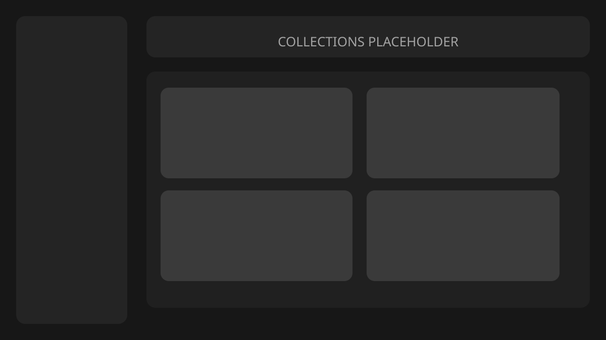
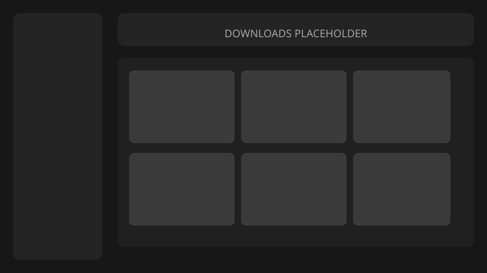
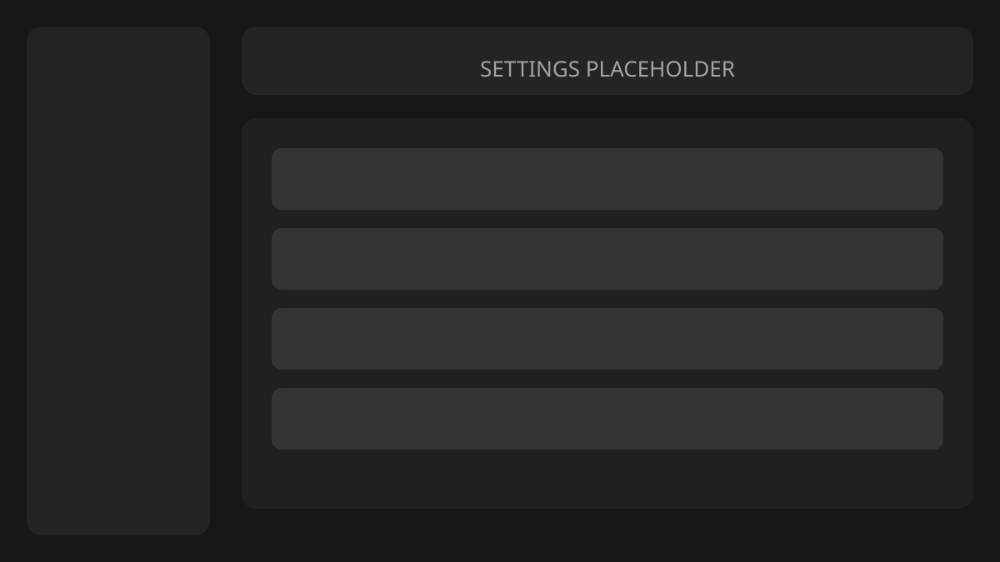

<p align="center">
  
</p>

<h1 align="center">WallDesk</h1>

<p align="center">
  A polished desktop wallpaper browser and manager for Windows.
</p>

<p align="center">
  Discover wallpapers, save your favorites, build collections, and apply
  everything directly to your desktop.
</p>

<p align="center">
  <a href="https://github.com/999shotoo/walldesk/releases">
    
  </a>
  <a href="https://github.com/999shotoo/walldesk/releases">
    
  </a>
  
  
</p>

> [!NOTE]
> The images in this README are placeholders until final product screenshots
> are added. Replace the files in [`docs/media/`](docs/media/) without changing
> the README layout.

## What is WallDesk?

WallDesk is a native Tauri desktop app with a Next.js interface for browsing
and managing wallpapers from Wallhaven. It combines a fast thumbnail feed with
native downloads, desktop wallpaper controls, local favorites, imported
collections, offline library access, and a customizable appearance.

The app is designed to feel like a focused desktop tool rather than a website
inside a window: files are saved to your normal Pictures folder, wallpaper
changes happen through a Rust backend, and preferences stay on your machine.

## Screenshots

<p align="center">
  
</p>

<p align="center">
  
</p>

<p align="center">
  
</p>

<p align="center">
  
</p>

<p align="center">
  
</p>

<p align="center">
  
</p>

## Demo

Click the preview below to open the demo recording once it is added:

<p align="center">
  <a href="docs/media/walldesk-demo.mp4">
    
  </a>
</p>

Add the recording at `docs/media/walldesk-demo.mp4`. A useful demo should show:

1. Browsing the popular feed.
2. Searching and changing filters.
3. Opening a wallpaper and applying it.
4. Downloading and favoriting a wallpaper.
5. Opening the local library.
6. Importing a collection.
7. Switching themes and settings.

## Features

### Browse

- Popular Wallhaven feed with infinite scrolling.
- Search by keyword.
- General, Anime, People, or all-category filtering.
- Trending, newest, relevance, views, favorites, and random sorting.
- Top-list time ranges.
- Color, orientation, aspect-ratio, and resolution filters.
- Minimum-resolution and exact-resolution presets.
- Full wallpaper detail pages with preview and metadata.

### Manage

- Apply wallpapers directly from cards or detail pages.
- Download, or download and apply in one action.
- Crop, fit, stretch, center, span, and tile modes.
- Download progress with byte and percentage feedback.
- Favorites persisted locally.
- Imported public Wallhaven collections.
- Local Downloads library with missing-file detection.
- Re-download a file when its local copy is missing.
- Native context-menu actions for wallpaper cards.

### Personalize

- Light, dark, and system themes.
- Six color palettes.
- Optional smooth scrolling.
- Optional image transition animations.
- Responsive wallpaper grid.
- Shadcn-style loading skeletons.
- Subtle tab, card, switch, and button feedback.
- Offline notices for network-only areas.

### Native

- Tauri 2 desktop shell with a frameless application window.
- Rust-powered wallpaper application.
- Files saved to `Pictures/WallDesk`.
- Local settings, favorites, collection, and download stores.
- Safe filename handling before files are written.
- GitHub Release update checks and passive updater installation.

## Download

Download the latest Windows installer from
[GitHub Releases](https://github.com/999shotoo/walldesk/releases).

WallDesk currently targets Windows. The frontend and Rust code use several
cross-platform Tauri APIs, but the supported release workflow and desktop
wallpaper behavior are Windows-focused.

## Development

### Requirements

- Windows 10 or newer
- Node.js 20 or newer
- npm
- Rust stable with the MSVC toolchain
- Visual Studio Build Tools with **Desktop development with C++**
- WebView2

See the official
[Tauri Windows prerequisites](https://tauri.app/start/prerequisites/#windows)
for the complete setup.

### Setup

```bash
git clone https://github.com/999shotoo/walldesk.git
cd walldesk
npm install
```

Run the frontend:

```bash
npm run dev
```

Run the complete desktop app:

```bash
npm run tauri dev
```

The Tauri development command starts the Next.js dev server automatically.
Test native features inside the Tauri window because browser mode cannot fully
provide filesystem, wallpaper, store, or updater APIs.

### Build

Build the static frontend:

```bash
npm run build
```

Build the native application and installer:

```bash
npm run tauri build
```

The frontend export is written to `out/`. Tauri packaging and updater artifacts
are configured in [`src-tauri/tauri.conf.json`](src-tauri/tauri.conf.json).

## Settings and local files

WallDesk stores user data locally through Tauri's store plugin:

| Store | Contents |
| --- | --- |
| `settings.json` | Fit mode, resolution, smooth scrolling, image motion, and optional Wallhaven key |
| `favorites.json` | Saved wallpaper records |
| `collections.json` | Imported Wallhaven collection references |
| Downloads ledger | Local file paths and download metadata |

Downloaded images are written to:

```text
Pictures/
└── WallDesk/
    └── <provider>-<wallpaper-id>.<extension>
```

Anonymous browsing works without an API key. An optional personal Wallhaven
key can be entered under **Settings → Advanced**. It is stored locally and sent
as an `X-API-Key` header instead of being placed in request URLs.

## Providers

Wallhaven is the active provider. A Pexels integration remains in the codebase
but is disabled by default because a distributed client-side API key cannot be
kept secret.

## Project structure

```text
walldesk/
├── app/                  Next.js routes, layouts, and global styles
├── components/
│   ├── common/           Feed, cards, downloads, scrolling, and offline UI
│   ├── home/             Home-page search interface
│   └── ui/               Shared shadcn-style components
├── lib/                  API, stores, settings, downloads, filters, and helpers
├── docs/media/           README screenshots and demo placeholder
├── public/               Splash-screen assets
└── src-tauri/
    ├── src/lib.rs        Tauri setup, startup, updater, and IPC
    ├── src/wallpaper.rs  Native downloads and wallpaper operations
    ├── capabilities/     Tauri permissions
    └── tauri.conf.json   Window, bundle, and updater configuration
```

## Performance

WallDesk is built for image-heavy feeds:

- Cards use provider thumbnails instead of full-resolution images.
- Full-size files are fetched only for user actions.
- Images after the first visible group use lazy loading.
- Responsive `sizes` hints reduce unnecessary image transfers.
- Wallpaper cards are memoized.
- Feed pages are deduplicated with independent provider cursors.
- Download progress is throttled before it crosses the IPC bridge.
- The default equal-height layout uses a regular CSS grid.
- Smooth scrolling is opt-in so native scrolling remains the default.

## Privacy

WallDesk contains no analytics or telemetry system. Settings, favorites,
collections, and download metadata stay on the local machine.

The app may connect to:

- `wallhaven.cc` for wallpapers, search, collections, and downloads.
- GitHub Releases for update metadata and update packages.
- Pexels only if its provider integration is explicitly enabled.

Users are responsible for following each provider's terms, rate limits,
licensing, and content policies when downloading images.

## Contributing

Issues, feature requests, and focused pull requests are welcome.

Before opening a pull request:

```bash
npm run build
git diff --check
```

Also test Tauri-dependent behavior with `npm run tauri dev`, and do not commit
personal API keys, local settings, generated installers, or private media.

## Acknowledgements

- [Wallhaven](https://wallhaven.cc/) for the wallpaper API.
- [Tauri](https://tauri.app/) for the native desktop runtime.
- [Next.js](https://nextjs.org/) and [React](https://react.dev/) for the UI.
- [Tailwind CSS](https://tailwindcss.com/) and shadcn/ui patterns.
- [Lenis](https://lenis.darkroom.engineering/) for optional smooth scrolling.
- [Framer Motion](https://motion.dev/) for selected UI transitions.

---

<p align="center">
  Made for people who care about their desktop.
</p>
